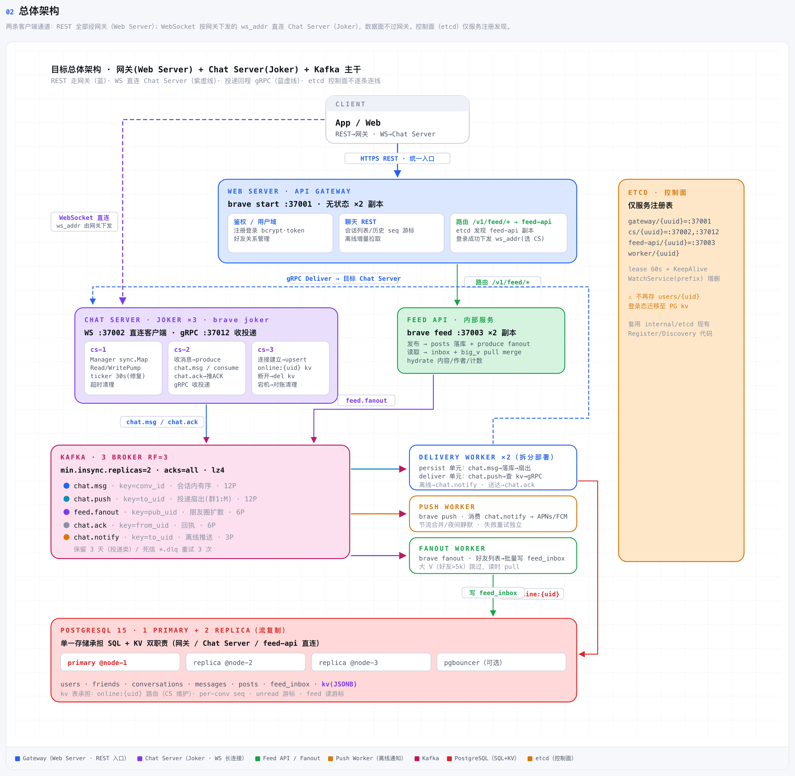
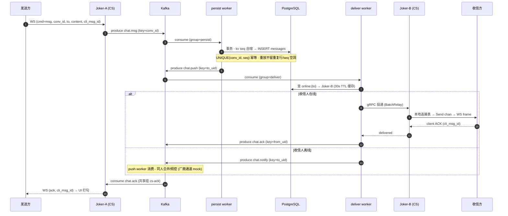
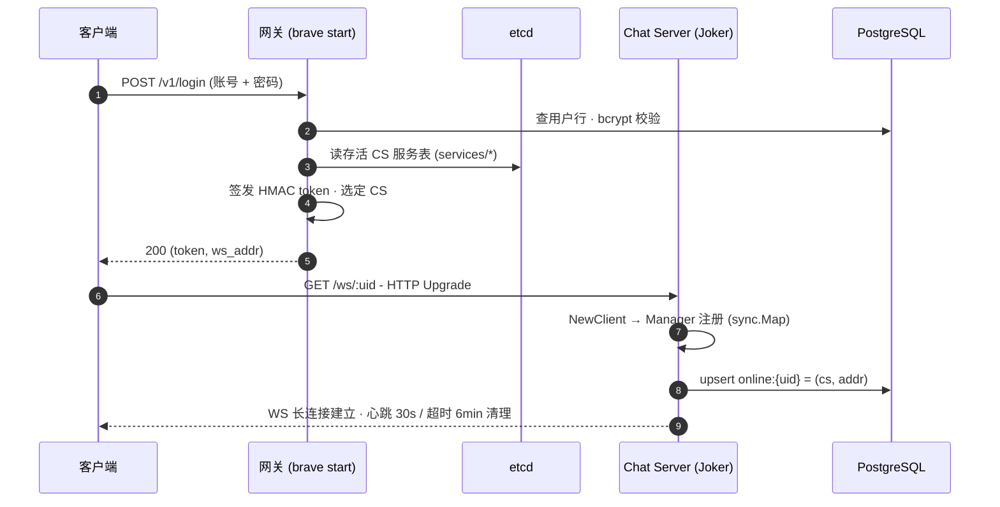
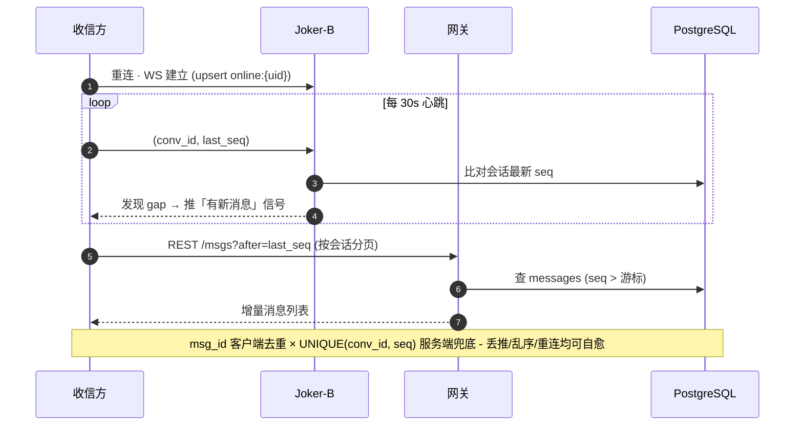
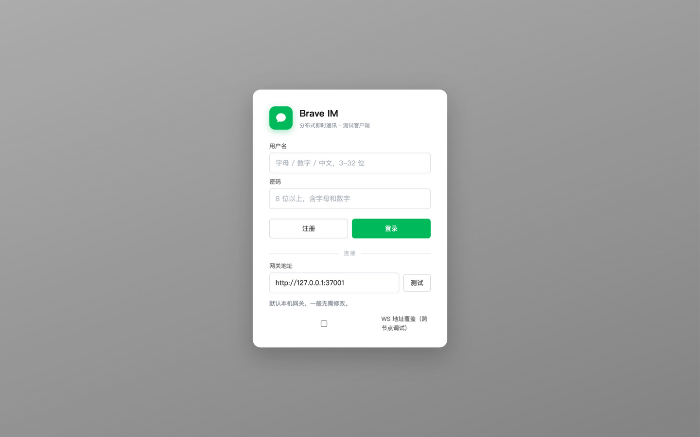
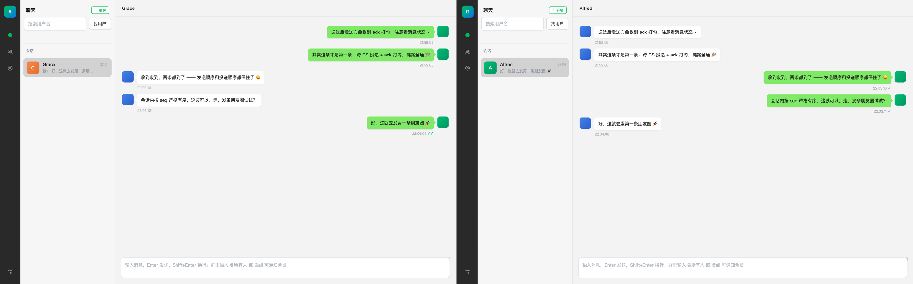
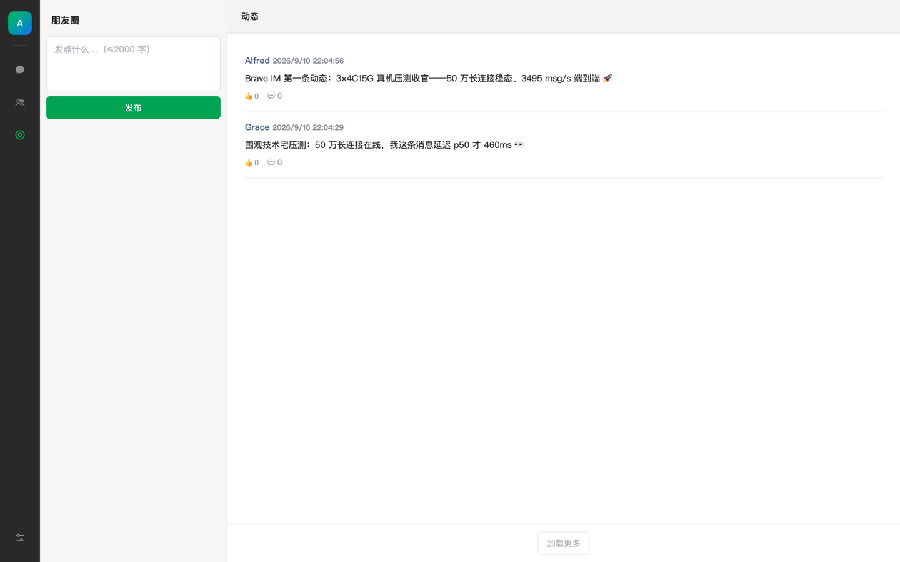

# Alfred Brave · 分布式即时通讯系统


> 仿微信形态的分布式即时通讯系统：单聊 / 群聊 / 朋友圈 + 在线状态与离线通知。Kafka 消息主干 + PostgreSQL（SQL+KV 双职责）+ etcd 服务发现 + gRPC 跨节点投递。架构参考 [link1st/gowebsocket](https://github.com/link1st/gowebsocket) 的思想，代码为独立实现；目标架构见 `docs/target-architecture.html`（v4），决策记录见 `docs/architecture-decisions.md`（D01–D22）。
>
> **诚实声明**：下文严格区分【已实现】与【设计/计划中】；所有性能数字来自 **2026-09 真机压测实测**（3×4C16G 腾讯云 CVM），原始数据与取证归档于 `docs/stress-results/`，可复核。判读口径遵循 **"TPS 是事实，DAU 是估值"**——端到端吞吐为实测，DAU 为按公开系数反推的区间估计。

---

## 📈 一页看懂 · 真机实测性能

**环境**：3×4C16G 腾讯云 CVM（Ubuntu 26.04 · cgroup v2 · 业务进程 systemd 直跑）；**SUT 自打**——压测 driver 与被测服务同机，所有数字**含客户端开销**（更保守）。

| 轴 | 指标 | 实测值 | 证据 |
|---|---|---|---|
| 连接 | 稳态并发长连接 | **501,752**（164k / 175k / 162k，数小时稳定） | 三轮采样截图 + 采样对账 |
| 连接 | 建连能力 | **710,000 / 波，0 失败**（三轮复现） | worker 报告 + `ss` 对账 |
| 连接 | CS 每连接内存（调优后） | **~20KB 活堆** / 30–40KB RSS | pprof 堆画像（调优前 45–66KB） |
| 消息 | 端到端单向吞吐 | **3,495 msg/s** 稳态（9 万连接 × 10 分钟） | 四重对账（客户端/Kafka/PG/LAG） |
| 消息 | 落库一致性 | 发送 **2,060,823 = PG 新增行**，分毫不差，零重试放大 | report.json + LAG 跑后归零 |
| 消息 | 投递到达率 | **99.89%**（lost 0.111%，at-least-once + 补拉兜底） | 投递账本 |
| 消息 | 单向延迟 | **p50 460ms** / p95 1.51s / p99 4.2s | 10ms 桶直方图 |
| 消息 | ACK 回执 | **99.89% 覆盖**，p50 650ms | ack 账本 |
| 容量 | DAU 反推（预注册判据） | **×10 平均口径 30 万成立**；×20 全包络（需 T≥3600/s）未宣称 | 判据表 + 冻结口径终测 |

<details>
<summary><b>🔍 压测战役逼出的容量级修复（点击展开）</b></summary>

**连接轴（S1 → S1b，六轮迭代定位）**

- **Send chan 预分配税**：`make(chan []byte, 1000)` 每连接 ~24KB 纯坐地税，1000→32 后 CS 内存 **-55%**（pprof 实锤，占活堆 40%+）；
- **日志级别 = 容量参数**：debug 日志在事件循环里刷屏（30s 22k 行 → info 后 1 行），洪峰直接吃掉吞吐；
- **心跳反压死亡线**：`SendResponse` 裸阻塞写 `Send chan` → WritePump 慢 → ReadPump 冻结 → 6 分钟 TCP 读超时**静默**关闭。指纹公式 **存活 ≈ 建连速率 × 6 分钟**，三节点吻合（修复留作 S1c）。

**消息轴（S3 → S3c → S3d，12 项问题 P1–P12）**

- persist 批路径 kv key 前缀错误引发 23505 crash-loop → 一行修复 + 数据 heal；
- produce 空键单热分区（12 分区只有 1 个有数据）→ `single_key(from,to)` 确定性分区键；
- deliver ack 串行税（每条送达同步 produce）→ 批尾 WriteBatch，230 → ~5100/s；
- ack 广播改共享组 + `BatchRelayAcks` 批转发，ack p50 14s → **650ms**；
- proto 增 `BatchRelayMessages`（保持 Unary）+ deliver ×6 实例，慢消费隔离（send_full 遥测全程为 0）；
- persist 批幂等（seq 分配前去重 + 重放），at-least-once 重试帧不再烧 seq 留空洞。

完整问题矩阵与代码对照：[dau-campaign-report.md](docs/stress-results/2026-09-07-S1/dau-campaign-report.md) §1.2

</details>

> 纯 CS 形态（中间件/网关/压测机全部外置）预估容量 **90–110 万**——这是推算值而非实测值，诚实口径以 50 万稳态 / 71 万建连为准。详见 [findings.md](docs/stress-results/2026-09-07-S1/findings.md)。

---

## 🏗️ 系统架构



> 完整设计文档（11 章，含在线状态机 / 群聊 / 朋友圈 / 存储 / Kafka topic / 部署）：[docs/target-architecture.html](docs/target-architecture.html)

**消息投递与 ACK（跨节点，已实现并真机验证）**



<details>
<summary><b>🔍 登录接入握手 · 离线补拉自愈（点击展开）</b></summary>

**登录接入（网关选点 → WS 直连 → online kv）**



**离线与重连补拉（at-least-once 下的最终一致）**



设计版时序原图（含注释）：[chat-link-design.png](picture/architecture/chat-link-design.png)

</details>

- **跨节点路由**：etcd 存服务注册表（lease 60s）；投递路由权威在 PG kv（`online:{uid}` → CS 地址），由持有连接的 Joker 唯一写，GHOST 对账任务 60s 清理宕机残留。
- **投递语义**：at-least-once（Kafka acks=all）+ msg_id 幂等落库 + 客户端按 seq 补拉兜底。
- **职责分界**：网关不接触消息数据面；Joker 不做跨节点路由决策——路由统一在 deliver worker（查 kv + gRPC），单一位置可测试可观测。

---

## 🚀 快速开始（本地全栈）

```bash
make local-up                                        # PG/etcd/Kafka + 双 Joker + 全部 worker
open http://127.0.0.1:37001/web/                     # 测试客户端（两窗口两账号 = 跨 CS 全流程）
go run ./tools/e2e -gateway http://127.0.0.1:37001   # 脚本化端到端验收
make test                                            # 单元测试
```

---

## 🖥️ Web 测试客户端（真实运行截图）

无框架单页客户端（`web/`，原生 JS + CSS ~940 行），微信桌面版三栏布局：深色导航 · 会话/列表栏 · 内容区。支持注册登录、单聊（Enter 发送、✓✓ 送达回执）、群聊（@所有人 权威校验）、通讯录加好友、朋友圈发布与时间线。以下均为本地全栈真实运行截图，双账号由网关分配到**两台不同 Chat Server**（Alfred → cs-2，Grace → cs-1），消息走跨节点投递链路。

| 登录 / 接入（网关下发 ws_addr，WS 直连 CS） | 跨节点单聊（同一会话双视角，✓✓ = 送达 ack） |
|:---:|:---:|
|  |  |

**朋友圈**：发布落库 + 异步 fanout，时间线 inbox+pull merge（好友动态实时可见，👍/💬 计数聚合）：



---

## ✅ 【已实现】（每条可指到代码）

| 能力 | 位置 | 验证 |
|---|---|---|
| 网关：token 鉴权（HMAC）、etcd 选 CS 下发 ws_addr | `server/`、`internal/token` | 单测 + e2e |
| Chat Server：WS 连接管理、客户端心跳（30s）+ 6 分钟超时清理 | `joker/exchange` | 单测（D14）+ 真机 50 万连接 |
| cmd 注册式路由（login/heartbeat/msg） | `joker/exchange/router.go` | 单测 |
| Kafka 主干：chat.msg / chat.push / chat.ack / chat.notify / feed.fanout | `internal/chat`、`internal/kafka` | 集成 + 真机 3,495/s |
| persist：事务 { kv seq 自增 → INSERT → last_seq }，确定性 msg_id 幂等重放（无 seq 空洞）+ 批路径幂等 | `worker/persist` | 集成（终测 206 万条零重试放大） |
| deliver：online kv 30s TTL 缓存 + not-found 即时校正 + gRPC 批量投递（BatchRelay ×6 实例）+ send_full 遥测 | `worker/deliver`、`joker/relay` | 集成（双节点漂移）+ 终测 99.89% |
| ACK 链路：共享消费组 + 批拉批提交 + 本机直写/异机 BatchRelayAcks | `joker/exchange/ack.go` | 集成（p50 650ms） |
| 在线状态：Joker 唯一写 online:{uid}（含漂移保护条件删）；GHOST 对账 60s | `worker/ghost` | 集成 |
| 群聊：groups/group_members、owner-only 权限矩阵、群事件即消息（D09）、投递层写扩散（仅在线成员扇出）、@/@all 权威校验、成员时间窗历史 | `database/group.go`、`server/api/group.go`、`worker/persist` | 14 用例矩阵 + 集成 |
| 朋友圈：发布同步落库 + 异步 fanout（500/批）、inbox+pull merge 读取（cursor 分页、tombstone 过滤、hydrate）、点赞/评论 + 计数定时聚合 | `feed/`、`worker/fanout` | 集成 |
| 离线通知：chat.notify + push worker（60s 同人合并、20/h 频控）——**厂商通道为 mock（演示级）** | `worker/push` | 单测 |
| 存储：PostgreSQL + pgx v5 + goose(postgres)；kv 表兼作 KV（online/seq） | `database/` | 集成 |
| 压测客户端：hold（建连/保活）/ storm（单向延迟分位数）/ storm-echo（RTT 交叉验证），roster 账本、多源 IP、并行发送、10s 周期资源采集 | `tools/stress` | 真机战役主力工具 |
| systemd 真机部署形态：角色化 unit、按机内核调优档（fd/tcp_mem）、中间件编排、2+1'↔混部拓扑切换 | `deploy/systemd/` | **真机执行**（整个压测战役） |
| 内核调优：连接档（80 万 fd）/ 保守档分级 sysctl + limits，压测-调优-压测闭环 | `docs/kernel-tuning.md`、`deploy/systemd/tuning/` | 真机执行 |
| 本地 compose 全栈（双 Joker 验证跨 CS）+ 端到端验收脚本 + Web 测试客户端 | `deploy/local/`、`tools/e2e`、`web/` | e2e PASS |

## 🧭 【设计/计划中】（未实现，均为设计方案）

- **生产容器化三节点**：`deploy/prod/`（docker compose，PG 流复制）脚本完整自洽但**未执行**——真机压测走的是 systemd 形态（砍 PG 副本/统一容器化，取舍见 `deploy/systemd/README.md`）。
- **S1c 心跳反压修复**：`SendResponse` 加 select+超时（或心跳回执绕过 Send chan），修完 71 万建连可转稳态；连带纯 CS 百万形态复测。
- **拓扑解耦**：PG 独立机 / 外置压测 driver——终测判定的"下一杠杆"（当前拓扑硬上限带 3.5k–4.5k msg/s）。
- **群聊扇出压测未跑**（D13 口径 30 万 DAU 需 15,600 TPS）：终测全部为单聊 1:1，群聊容量为组合推演（甜点区 = 群占比 5%–10%）；push worker 消费上限未测。
- D15 心跳 seq 对账的服务端比对段（客户端按 seq 补拉已实现）。
- PG 读写分流（feed 读走 replica）、DLQ 死信 topic、消息未读数/已读回执/撤回（D10 明确不做）。

---

## 🧪 压测战役归档

| 战役 | 日期 | 内容 | 报告 |
|---|---|---|---|
| S0 | 09-06 | 本地 compose 冒烟，采集链路联调 | `docs/stress-results/2026-09-06-S0-local/` |
| S1 / S1b | 09-07 | 连接轴：425k 基线 → 调优后 **501,752 稳态 / 71 万建连**；六轮根因迭代 + pprof 取证 | [findings.md](docs/stress-results/2026-09-07-S1/findings.md) |
| S3 / S3c / S3d | 09-08 | 消息轴：205 TPS 瓶颈定位 → 批量化 + 12 项投递链修复 → **3,495/s 冻结口径终测** → DAU 反推与单聊/群聊配比 | [dau-campaign-report.md](docs/stress-results/2026-09-07-S1/dau-campaign-report.md) |

- 硬件台账（SSH 实测落档）：`docs/stress-machines.md` · 压测方案与判读口径：`docs/stress-plan.md`
- DAU 甜点区结论：群占比 **5%**（留 15% 反压余量保 30 万×10）～ **10%**；30 万 ×20 全包络当前硬件不可达（纯单聊极限 3,435 < 需求 3,472）。

---

## 🛠️ 技术栈

**Go 1.21** · Gin · gorilla/websocket · gRPC（Unary）· segmentio/kafka-go · PostgreSQL（15 本地 / 18 真机原生）+ jackc/pgx v5 + pressly/goose v3 · etcd v3.5 · viper / urfave-cli · logrus

## 📁 目录结构

```
├── cmd/brave.go          # 单二进制入口（urfave/cli 子命令：joker / persist / deliver / ...）
├── commands/             # 各子命令定义
├── server/               # HTTP API 网关（注册登录、群组、feed、ws_addr 下发）
├── joker/                # Chat Server：WS 连接管理、cmd 路由、gRPC relay
├── worker/               # Kafka 消费者：persist / deliver / push / fanout / ghost
├── feed/                 # 朋友圈领域模型
├── database/             # PostgreSQL 数据访问 + goose 迁移
├── internal/             # 基础设施：kafka / etcd / token / snowflake / abort / i18n ...
├── web/                  # 无框架 Web 测试客户端（微信桌面版三栏布局）
├── tools/                # stress 压测客户端 · e2e 验收 · faildrill 故障演练
├── deploy/               # local compose · systemd 真机形态 · prod 三节点（未执行）
├── docs/                 # 架构设计（v4 HTML）与决策记录、压测方案与结果、内核调优
└── picture/              # 截图：architecture（架构图源 docs/target-architecture.html）· client（客户端实机运行）
```

## 📚 更多文档

- **压测**：[压测方案](docs/stress-plan.md) · [真机台账](docs/stress-machines.md) · [S1/S1b 连接轴报告](docs/stress-results/2026-09-07-S1/findings.md) · [S3 系消息轴战役报告](docs/stress-results/2026-09-07-S1/dau-campaign-report.md)
- **架构与决策**：`docs/target-architecture.html`（v4）· `docs/architecture-decisions.md`（D01–D22）
- **分布式 IM 设计深挖参考**：`docs/distributed-im-system-design-interview-reference.md`
- **部署**：`deploy/local/README.md`（本地）· `deploy/systemd/README.md`（真机形态）· `deploy/prod/README.md`（生产，未执行）
- **任务规格与验收记录**：`docs/specs/`（T01–T19 逐任务四阶段）
