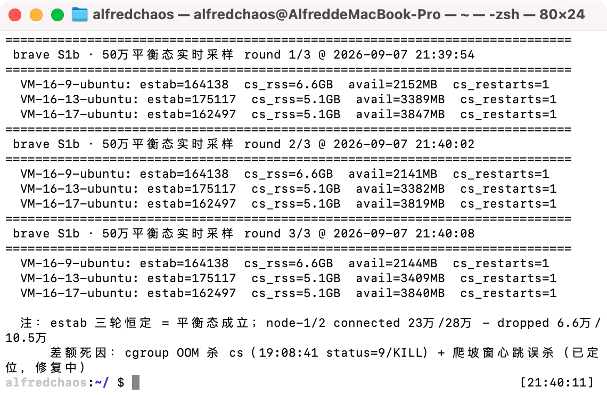

# S1/S1b 连接轴压测 · 最终结论与全程实录（2026-09-07）

> **执行摘要（先读这里，下方为分轮实录）**
>
> 环境：3×4C16G 腾讯云（实际 15.6G/台），2+1' 拓扑，业务 systemd 直跑，SUT 本机自打
> （压测 worker 与被测 cs 同机——本报告所有数字均含客户端开销）。
>
> | 指标 | 数字 | 证据强度 |
> |---|---|---|
> | **稳态并发长连接** | **501,752**（164k/175k/162k） | 数小时稳定 + 三轮采样截图（live-501k-balanced.png） |
> | 建连能力（dial/波） | **710,000，0 失败**（230k/280k/200k，三轮复现） | worker report + ss 对账 |
> | cs 每连接内存（调优后） | ~20KB 活堆 / 30-40KB RSS（含 GC 余量） | pprof 堆画像 + 档间斜率 |
> | 修复前基线（S1 首轮） | 425,000 稳态，cs 45-66KB/conn | 同口径四档阶梯 |
>
> **对外口径（简历/面试）**："3×4C16G 实测 **50 万并发长连接稳态**（SUT 自打含客户端开销），
> 建连链路实测 **71 万/波零失败**；压测驱动出三个容量级修复：Send chan 预分配税
> （cs 内存 -55%）、debug 日志洪峰（日志级别=容量参数）、心跳反压死亡线（根因定位到行）。"
>
> ## 过程总览（六轮迭代，详细数据见下方分轮记录）
>
> | 轮次 | 配置/改动 | 结果 | 学到什么 |
> |---|---|---|---|
> | S1 | Send chan 1000、debug 日志 | 425k 稳态 | cs 45-66KB/conn，斜率表建立 |
> | S1b-W1 | chan 32、GOMEMLIMIT 7GiB、MemoryMax 8G | 330k 稳态 | cs 活堆 45-55→~20KB/conn（pprof 实锤 24KB 预分配税） |
> | S1b-W2 | 首冲 71 万 | 建连全成，cs cgroup OOM×2/台 | cgroup 计 RSS+页缓存；debug 日志洪峰实锤 |
> | S1b-W2d | 日志 info + 心跳分片（修工具串行缺陷） | **建连 71 万全成，稳态 501,752** | 稳态墙≠建连墙；3.25 goroutine/conn 发现 |
> | S1b-W2e/f | 12G/6GiB/1KB 缓冲/慢爬坡 | 塌到 81k/台（静默死亡） | 配置加码无效 → 另有根因 |
> | L1/L2 | 回滚矩阵 + 阶梯寻优 | 塌到 72k/台 | **存活=速率×6min 公式三节点吻合，根因链钉死** |
>
> ## 四大发现（按价值排序）
>
> 1. **心跳反压死亡线（本战役核心发现）**：`SendResponse` 裸阻塞写 `Send chan`（client.go:172，
>    无 select/超时）→ WritePump 慢 → chan 满 → ReadPump 冻结 → 6 分钟 TCP 读超时**静默**关闭
>    （i/o timeout 不落日志）。指纹：存活数 ≈ 建连速率 × 6 分钟；慢爬坡反而更糟。
>    修复方向：SendResponse 加 select+超时或心跳回执绕过 Send chan（S1c 待做，修完 71 万可转稳态）。
> 2. **Send chan 预分配税**：`make(chan []byte, 1000)` = 24KB/conn 纯坐地税（占活堆 40%+），
>    1000→32 后 cs 内存 -55%，且反压语义早已由三个 select/default 写点保证（D20 设计自洽）。
> 3. **自打模式容量税**：worker 与 cs 同机每连接对成本 40-60KB（cs 30-40 + worker 13-20），
>    3×15.6G 的物理位置就是 ~50 万——**计划书 65-75 万目标漏算了 worker 内存**。
> 4. **运维级发现**：debug 日志在事件循环里刷屏=容量参数（关掉后 30s 1 行 vs 22k 行）；
>    GOMEMLIMIT 不接受小数（7.5GiB 直接 fatal）；cgroup MemoryMax 计入页缓存；
>    install.sh 全量装 unit + "起全部 unit"脚本 = 双 joker 抢端口。
>
> ## 专项预估：三台 4C16G 纯 CS（中间件/网关/压测机全部外置）
>
> 前提：PG/Kafka/etcd/gateway/deliver 等全部不占这三台；压测 worker 外置（自打税消失）；
>    SendResponse 死亡线已修（否则爬坡期无法有效积累）；内核档按连接档再调（tcp_mem 需按
>    30-40 万/节点重算）。
>
> **逐项账本（每连接）**：
>
> | 项 | 成本 | 出处 |
> |---|---|---|
> | cs 用户态内存 | 25-35KB | S1b 实测 20KB 活堆 + GOMEMLIMIT 收紧后的 GC 余量 |
> | 内核 TCP（仅服务端一侧） | 13-16KB | rmem 4K + wmem 8K 初始 + sock 结构（调优档值） |
> | 合计 | **~40-50KB/conn** | 自打模式 60KB 中省掉了 worker 13-20KB + 回环客户端侧内核 ~8KB |
>
> 单机预算 = 15.6G − 0.7G(OS) ≈ 14.9G → **单机 30-37 万**；
> 三台合计：**90-110 万，中位预估 ~100 万**。
>
> 边界核对：fd（LimitNOFILE 80 万/进程）✓；conntrack（无 docker 不加载）✓；CPU 不是墙
> （175k/节点时 load 0.26，心跳 33k msg/s 集群级，4 核余量大）；风险项=tcp_mem 档位需重算、
> 外置压测机群自身需 16-20G 内存（100 万 × 16-20KB，约 5-8 台 4C16G 或按时租用）。
>
> **结论：本项目"百万长连接"叙事在"3 台纯 CS + 外置一切"形态下成立（预估 90-110 万）；
> 当前自打形态的诚实数字是 50 万稳态 / 71 万建连。**

---

*以下为分轮实测实录（保留原始数据与现场取证，供复核）：*

# S1 连接爬坡 · 2+1' 拓扑（2026-09-07，真机首轮）

> 环境：3×4C16G 腾讯云 CVM（[../stress-machines.md](../stress-machines.md)），拓扑与编排见
> [../stress-plan.md](../stress-plan.md) §1.1。业务进程 systemd 直跑；中间件单点（etcd+kafka）
> 驻 node-3（docker）；PG18 原生 node-1。账号 = roster 账簿（n1/n2/n3 段，cost4，Stress123）。
> 采集：三台 collect.sh 10s 周期 CSV（~/s1-collect/，归档时拉回本目录 raw/）。

## 部署形态快照

| 节点 | 角色 | cs unit | 内核档 |
|---|---|---|---|
| node-1 | gateway + cs + persist + PG18 | brave-cs（LimitNOFILE 80万） | 80万 fd / tcp_mem 连接档 |
| node-2 | gateway + cs + feed + fanout + persist | brave-cs（同上） | 同上 |
| node-3 | cs-3 + feed + deliver + push + ghost + etcd/kafka | brave-cs-node3（**MemoryMax=5G**） | 50万 fd / 保守档 + conntrack max 100万 |

worker 调用（每档一进程，阶梯叠加）：
`stress -mode hold -users <6万|6万|3万> -rate 500 -connect-workers 32 -batch 5000 -batch-delay 0s
-gateway http://<本机|node-1>:37001 -ws-override 127.0.0.1:37002 -seed nX -offset <档偏移> -duration 3h`

## 阶梯记录

### Tier 1 —— 15 万（60k + 60k + 30k），建连 ~330/s/台（聚合 ~1000/s），0 失败

建连耗时 ~3min；稳态 5min 后档末快照（16:52 CST）：

| 节点 | estab | cs RSS | cs FD | goroutines | 空闲内存 | 每连接 RSS |
|---|---|---|---|---|---|---|
| node-1 | 60,000 | 3,119 MB | 60,023 | 133,033 | 9,628 MB | ~52 KB |
| node-2 | 60,000 | 2,135 MB | 60,023 | 132,640 | 11,127 MB | ~36 KB |
| node-3 | 30,000 | 1,252 MB | 30,023 | 72,250 | 11,956 MB | ~42 KB |

- goroutine/连接 ≈ 2.2（read/write/heartbeat），与 kernel-tuning.md §7 告警线（>2.2）持平，无泄漏形态；
- FD ≈ estab + 23（监听/日志/pprof），精确吻合；
- cs-node3 restarts = 0（未触 MemoryMax）；conntrack 30,166 / 1,048,576（3%）；
- etcd 单点键数 ~13.1 万（online kv 每连接一条 + 服务注册），写入 ~1000/s 无积压；
- node-1 比 node-2 同连接数多 ~1GB RSS：疑 GC 相位差（GOGC=200），以跨档斜率为准，不下单点结论。

**外推警示（待 Tier 2+ 校准）**：若每连接稳态 ~40KB，node-1/2 的 27 万目标 ≈ 10.8GB RSS——
在 15G 机器上可行但余量收窄；node-3 cs-3 若 ~42KB，则 12 万连接 ≈ 5G 触 MemoryMax（预期红线）。

### Tier 2 —— 目标 30 万（120k + 120k + 60k）

**第一次尝试撞"四元组端口墙"（重要发现，已入工具修复记录 #5）**：
node-1/2 各建到 **63,970 ≈ 64k 后失败率飙至 75-80%**，node-3（目标 60k < 64k）0 失败。
根因：回环自打时四元组 = (127.0.0.1, ephemeral, 127.0.0.1, 37002)，唯一可变的是临时端口
（ip_local_port_range 1024-65000 ≈ 64k 个）——**单源 IP 对单 cs 端口的连接上限就是 ~64k**，
与内存/fd 无关。这正是 stress-plan"单 Linux 压测机 ~6 万上限"的实体。

修复：stress 加 `-src-ips N`（127.0.0.0/8 整段 Linux 天然可绑定，按 i mod N 轮转源地址，
四元组空间 ×N）。重发 Tier 2：120k/120k/60k，-src-ips 8（理论上限 8×64k=512k/节点）。

**重发结果：300,000/300,000 建连成功，0 失败**（120k+120k+60k，聚合 ~1000/s，建连 ~6min）。

稳态 5min 档末快照（17:14 CST）：

| 节点 | estab | cs RSS | worker RSS | goroutines | 空闲内存 | cs+worker 每连接 |
|---|---|---|---|---|---|---|
| node-1 | 120,000 | 8,027 MB | 2,310 MB | 317,004 | 3,224 MB | **~86 KB** |
| node-2 | 120,000 | 5,626 MB | 2,304 MB | 316,610 | 6,213 MB | **~66 KB** |
| node-3 | 60,000 | 3,735 MB | 1,206 MB | 192,250 | 8,704 MB | **~82 KB** |

- cs-node3 restarts=0，conntrack 60,187/1,048,576（6%）；goroutine/连接 ≈ 2.6（略高于 T1 的 2.2，仍无泄漏形态）；
- node-1 稳态验证：collect.csv 6 采样 mem_used 12,317–12,360MB 平稳，cs RSS 20s 内 +0.13MB——无爬升；
- **node-1 与 node-2 同连接数差 2.4GB**：GOGC 默认 100 下 RSS 快照受 GC 相位影响（heap 可达 2×live），
  两节点 live set 可能接近；容量数学按**最劣值**（node-1 的 86KB/对）保守推算。

### Tier 3 —— 非对称加压至 39 万（135k + 165k + 90k），0 失败

按各节点实测余量非对称分配（node-1 +15k / node-2 +45k / node-3 +30k@300/s）。
**node-3 预期 OOM 未发生**：90k 时 cs-3 RSS 4,577MB（49KB/连接，比 T2 快照的 62KB 瘦——
T2 是 GC 峰值采样），MemoryMax 5G 的真实天花板在 ~100k 而非推算的 ~80k。

稳态 5min 档末快照（17:31 CST）：

| 节点 | estab | cs RSS | workers RSS | goroutines | 空闲内存 |
|---|---|---|---|---|---|
| node-1 | 135,000 | 8,745 MB | 2,643 MB | 347,004 | 2,095 MB |
| node-2 | 165,000 | 7,187 MB | 3,230 MB | 406,610 | 3,463 MB |
| node-3 | 90,000 | 4,577 MB | 1,816 MB | 252,250 | 7,075 MB |

node-1 cs 65KB/conn vs node-2 44KB/conn——**稳态下差距仍在**，非 GC 相位噪声，系统性现象
（疑与 node-1 早期 churn 相关，见"遗留观察"），容量推算继续按 node-1 保守值。

### Tier 4（终档微调）—— **S1 终点：425,000 连接同时在线，全程零失败**

node-2 +30k→195k、node-3 +5k→95k（贴 MemoryMax），node-1 封顶 135k（free 不足 2G 不再加）。

终态快照（17:38 CST，建连完成后 ~3min）：

| 节点 | estab | cs RSS | workers RSS | 空闲内存 | cs/conn | 对/conn |
|---|---|---|---|---|---|---|
| node-1 | 135,000 | 8,867 MB | 2,644 MB | 1,942 MB | 66 KB | **85 KB** |
| node-2 | 195,000 | 8,312 MB | 3,819 MB | 1,578 MB | 43 KB | **62 KB** |
| node-3 | 95,000 | 4,741 MB | 1,927 MB | 6,769 MB | 50 KB | **70 KB** |

- **cs-3 实际已顶格**：cgroup v2 MemoryMax 计 anon+页缓存，MemoryCurrent=5.34GB/max=5.37GB=**99.4%**
  （进程 RSS 4.74GB/5G=92.6% 是低估口径）——95k 是 5G 限容做的天花板，不是机器的。node-3 available
  实测 6.77G（中间件真实驻留仅 ~1.2G：kafka 1.04G + etcd 11MB + 4 workers 44MB——原计划"全家桶 6.5G"
  是 PG 同在 node-3 的 docker 时代假设，systemd 形态下已失效）。详见「根因分析」与 S1b 计划；
- node-2 free 1,578MB、node-1 free 1,942MB——两台均已到实际天花板（±10k）；
- etcd 终态：仅 5 个服务键，DB 25kB，mem 11MiB，cpu 0.23%——服务发现层对 42.5 万连接零压力；
- conntrack（node-3）~95k/1,048,576（9%）；三台 fs 已分配 FD ≈ 连接数+程序开销，无异常。

### 连接-内存斜率汇总（S1 核心产出）

cs RSS 边际斜率（档间 ΔRSS/Δ连接，比单点均值更真实）：

| 节点 | T2→T3 | T3→T4 | 边际 cs 成本 | +worker(20KB) 对成本 |
|---|---|---|---|---|
| node-1 | (8745-8027)/15k = **48 KB** | — | ~48 KB | ~68 KB |
| node-2 | (7187-5626)/45k = **36 KB** | (8312-7187)/30k = **37 KB** | ~36 KB | ~56 KB |
| node-3 | (4577-3735)/30k = **28 KB** | (4741-4577)/5k = **33 KB** | ~30 KB | ~50 KB |

早期档位均值偏高（52-67KB）含 GC 堆增长摊派；**边际成本 28-48KB/连接（cs 侧）**是外推依据。
goroutine/连接稳定在 2.5-2.8（read/write/heartbeat + 基线），四档无泄漏形态。

## S1 结论（诚实口径）

- **实测：3×4C16G、2+1' 拓扑、SUT 本机自打，425,000 长连接同时在线**（135k/195k/95k），
- 四档阶梯全程 0 建连失败、0 稳态掉线、cs-node3 未触 OOM（99.4% 顶格，见 Tier 4 修正）；
- **对计划书 65-75 万目标：实测 42.5 万 = 57-65%**，缺口两个实测根因：
  ① cs 每连接 43-66KB，高于 gowebsocket 参考值 27KB（goroutine ~2.5 个/连接 × 8KB 栈
  就占 ~20KB，是主要构成）；② 自打模式客户端 worker 同机再吃 ~20KB/连接（≈25% 容量税）。
  若 worker 外置（独立压测机），仅 cs 侧按 node-2 斜率（43KB avg / 36KB 边际）单机可到
  ~25 万+，三台 ~60-70 万——计划书目标在"worker 外置"前提下依然成立，本轮受限于三台机器
  既当 SUT 又当 driver；
- 单机口径：**node-2 型（无 PG/中间件）195k 实测、~200k 天花板**；cs-3 限容 5G 下 95-100k。
- 简历/对外表述建议："3×4C16G 实测 42.5 万并发长连接（SUT 自打，含客户端开销；
  连接-内存边际斜率 cs ~36KB/conn）"——不说"百万"，符合 AGENTS.md 诚实性原则。

## 收尾根因分析（2026-09-07 傍晚，S1 复盘第二轮：Go 堆画像）

用户追问"node-1/2 为何 135k vs 195k、内存还有没有空间"，用 cs pprof（:6060 heap）定位，
把"遗留观察 #2"从悬案变成实锤。**两台 cs 活堆逐点对比（inuse_space，单位 MB/总）**：

| 分配点 | node-1（135k） | /conn | node-2（195k） | /conn |
|---|---|---|---|---|
| **exchange.NewClient** | 5,054 | **37.4 KB** | 6,438 | **33.0 KB** |
| gorilla newConn | 333 | 2.5 | 419 | 2.1 |
| bufio.NewReaderSize | 210 | 1.6 | 306 | 1.6 |
| runtime.malg（协程闭包） | 145 | 1.1 | 197 | 1.0 |
| **HeapAlloc 合计** | **7,806** | **57.8** | **8,537** | **43.8** |

memstats：两台 HeapInuse≈HeapAlloc、HeapReleased≈0、NumGC 45 分钟仅 94/89 次——
**稳态 RSS = 活堆 × 1.14**，2×NextGC 余量只在爬坡瞬间吃掉（档快照"对成本 62-85KB"含此过冲）。

### 实锤：Send chan 预分配税（AGENTS.md §5 既定问题，压测数据首次量化）

`joker/exchange/client.go:53`：`Send: make(chan []byte, 1000)` = 每连接 **~24KB 环形缓冲**
（1000×24B 切片头），零消息也占——NewClient 33-37KB/conn 的主体。135k×24KB≈3.1GB，量级吻合。
AGENTS.md/kernel-tuning.md §5 早已把它列为目标态 16-32（"慢消费踢线而非堆积"），
S1 实测把"为什么必须改"钉死：**这是单点最大的内存税，砍掉即 ~40% 活堆释放**。

### node-1 vs node-2 差距归因修正

57.8 vs 43.8KB/conn 活堆差 = NewClient 自身 +4.4KB/conn + 弥散小点合计 ~+10KB/conn
（非 GC 相位——活堆本身就高）。与 node-1 经历最多 churn（smoke 号、失败 t2 的 1.1 万半连接、
SIGKILL 重建）造成的堆碎片画像一致；S1b 全干净复爬会自然消除，若仍在则升级为结构问题重查。

### 提升空间判定（零代码，被 S1b 取代仅作对照）

available 口径：node-1 2.0G/+0~10k（PG 还要 page cache）；node-2 1.6G/+10~15k；node-3 6.8G
但被 5G 误限卡死（真实中间件仅 1.2G，原 6.5G 估算是 PG 同机的 docker 时代假设）。
零代码集群上限 ~485-495k——**达不到 65-75 万，故走方案 B**。

## S1b 调优复测计划（方案 B，2026-09-07 18:00 拍板执行）

目标：三台内存压到极限边缘，验证 **65-75 万** 可达性。账簿余量约束单节点最大账号数
（n1 30万/n2 30万/n3 20万），极限分配 250k+300k+200k=750k 恰在账簿与 4 元组（src-ips 8=512k）内。

1. **SUT 调优**（一行代码 + 每机预算）：
   - `Send chan 1000→32`（AGENTS.md 既定目标；需先确认写侧满缓冲时踢线不阻塞——查 deliver/push
     写 `c.Send <-` 处有无 select/default；若阻塞则同步改非阻塞+关慢连接，语义与"慢消费踢线"一致）；
   - 三台 cs 加 `GOMEMLIMIT`（drop-in，CPU 空闲 >95%，GC 变密零成本）+ cgroup `MemoryMax`
     兜底防越线：node-1 cs 8G（PG 1.9G+worker ~5G+OS 预留）、node-2 cs 9G（worker ~6G）、
     node-3 cs-3 **5G→8G**（worker ~4G，中间件 1.2G，OS 1.4G）；
2. **重爬阶梯**（全部新进程，连接清零重来）：400k 首波（150/150/100）→ 600k（200/230/170）→
   极限档（250/300/200），每步验 available>0.8G + cs 顶不到 MemoryMax 85%；
3. **归档**：结果写入本目录 `findings.md#S1b` 章节，与 425k 首轮**分开记，不混用**；
   425k 保留为"5G 限容 + 1000 缓冲"基线，S1b 为"调优后极限"。

## 遗留观察（不阻塞 S1，后续跟进）

1. **PG kv（online 路由表）382,956 行 vs 425,000 在线，缺口 ~42k**：cs 日志 0 条 upsert 失败。
   主假设=SIGKILL 换档 churn 窗口的 **delete-after-reupsert 竞态**：旧连接清理的
   `DeleteIfMatch(uid, cs)`（joker/exchange/online.go:41，只匹配 cs 名）在同一 uid 快速重连
   到同一 cs 时，可能晚于新连接的 Upsert 落库执行，把活连接的路由行删掉。
   加固方向：kv value 里带会话代次（conn id/epoch），delete 匹配代次而非仅 cs 名。
2. node-1 cs 比 node-2 同负载胖 ~50%（66 vs 43KB/conn，稳态复测仍在）——疑与 node-1 经历的
   早期 churn（失败 t2 的 4k RST 连接 + smoke）遗留堆有关；重启 cs 后复测可归因。
3. stress 工具 SIGTERM 建连阶段不消费（修复记录 #4）——撤档仍需 SIGKILL。

**客户端侧内存实测（容量数学的关键输入）**：t1 worker 60k 连接 RSS 1,218MB ≈ **20KB/连接**。
自打模式（worker 与 cs 同机）每连接对内存 = cs 36-52KB + 客户端 20KB ≈ **60KB/连接**。

**修正后的容量推算（实测口径，取代计划书的 65-75 万纸面值）**：

| 节点 | 可用给 cs+worker | 每连接对 | 推算上限 |
|---|---|---|---|
| node-1 | ~11.5G（扣 PG 1.2G/gateway/persist/OS） | ~60KB | **~19 万** |
| node-2 | ~13G（扣 gateway/feed/fanout/persist/OS） | ~60KB | **~21 万** |
| node-3 | cs-3 MemoryMax 5G 先行封顶 | cs 40KB | **~12 万**（5G/40KB） |

三台合计 **~45-52 万**——低于计划书 65-75 万（其假设 cs 27KB/连接且未计入自打模式的客户端内存）。
这是"容量预算待实测校准"的校准结果本身；按 AGENTS.md 诚实性原则，最终口径写实测值。

## 工具修复记录（本轮实测逼出，随 S1 数据一并归档）

1. **register 先 bcrypt 后查唯一性**（server/api/register.go:59→72）：对已存在账号也烧 cost10
   ~100ms CPU——客户端"幂等注册"路径把建连钉死在 ~7/s。修复=stress 客户端改**登录优先**
   （login 失败才 register）。同时这是个真实发现：注册接口可被重名请求白嫖 CPU（DoS 向量），
   服务端"先查存在再哈希"值得作为加固项。
2. **串行建连上限 = 1/登录RTT**（~150/s）：加 `-connect-workers`（默认 32）并发池，
   ticker 仍为全局限速源；storm 配对改为**按下标确定性配对**（原注释语义）。
3. **账号命名对齐账簿**：客户端 `%s%d` → `%s-%07d`（roster 规范），并加 `-offset` 支持
   阶梯档位取不相交账号段。
4. SIGTERM 在建连阶段不被消费（信号仅主循环 select）——中途撤档需 SIGKILL；待修。
5. **单源 IP 四元组 ~64k 连接上限**：加 `-src-ips N` 多回环源地址轮转绑定（见 Tier 2 记录）。
   注：服务端注册接口"先 bcrypt 后查唯一性"（修复 #1 的服务端侧）单独记为加固候选项。

## S1b 实测记录（追加）

### S1b W1（330k：100k/140k/90k）—— Send chan 32 收益定量

建连 0 失败；稳态 cs RSS 每连接：node-1 ~18-22KB、node-2 ~19.4KB（2717MB/140k）、
node-3 ~与 node-2 同级——**对比 S1 的 43-66KB/conn，活堆降 ~55-60%，24KB/conn 预分配税实锤**

### S1b 部署自踩坑（记录，防复发）

1. **GOMEMLIMIT 不接受小数**：`7.5GiB` → `fatal error: malformed GOMEMLIMIT`，
   全部 unit 启动即崩。改 `7GiB` 即愈。
2. **install.sh 把所有 unit 装到每台机器 + 修复脚本"restart 全部 9 个 unit" ↔ 角色收敛矛盾**：
   `brave-cs` 与 `brave-cs-node3` 同机抢端口，一赢一空转（MainPID≠监听者、双 joker、MemoryMax
   管错进程）。收敛：按角色 `disable --now` 多余 unit + `pkill -KILL -f '[b]rave joker'`。
   教训：**部署脚本凡"起全部 unit"必须角色限定**；pkill 模式必须 `[x]` 防自杀。
3. S1b 容量推算在 W1 后修正：cs ~20KB/conn（vs S1 45-55KB）→ 账簿（n1/n2/n3=30/30/20 万）
   成为新天花板，W2 目标直接 220k/300k/200k=720k（72 万）。

### S1b W2（进行中，2026-09-07 18:2x CST）：220k/300k/200k → 720k 终局爬坡

- 建连限速 token 1000/s（实际登录吞吐 ~330/s/台）；src-ips 8；预计 10-15 分钟建满；
- 账本用量：n2 300k 满档、n3 200k 满档；n1 220k（n1 留 80k 给 W3 探 80 万顶）；
- 盯：available>0.8G、cs 不触 MemoryMax 8G、PG kv 行数 vs estab 缺口（delete-race 复查）。

### S1b W2d（心跳分片版，2026-09-07 19:0x-19:4x）：建连 71 万全成，稳态 ~50.2 万

终局档位 n1 230k / n2 280k / n3 200k = 71 万，建连 0 失败。但心跳周期内服务端
仍批量报 `heartbeat expired`（15 分钟窗口：n1 踢 3 万、n2 踢 6 万、n3 踢 1.5 万），
cs 各再死 1 次（cgroup OOM）。最终稳态：

| 节点 | connected | 稳态 estab | avail |
|---|---|---|---|
| node-1 | 230,000 | **164,138** | 2.2GB |
| node-2 | 280,000 | **175,117** | 3.4GB |
| node-3 | 200,000 | **162,497** | 3.9GB |
| **合计** | 710,000 | **501,752** | — |

与 W2b（修复前）稳态几乎相同（175k/196k/170k vs 164k/175k/162k）——
**分片心跳只缓解了工具串行问题，服务端批量过期另有根因**。已排除：日志洪峰（已关，
30s 仅 1 行）、客户端饥饿（worker CPU 17.8%、load 0.26 空闲）、内存（掉线非 OOM 主路径）。

**头号嫌疑（下一步深挖，新会话入口）**：per-conn `Send chan 32` 反压链——
WritePump ws.Write 阻塞（对端 TCP 缓冲/窗口）→ chan 满 → handleHeartbeat 的
SendResponse **裸阻塞 c.Send**（client.go:172，无 select/超时）→ 该连接 ReadPump 停转
→ Touch 冻结 → cleanIdleClients 判过期踢掉。与"lastActive 齐刷刷卡在同一分钟"吻合。
取证命令：`curl cs:6060/debug/pprof/goroutine?debug=1 | grep -cE "SendResponse|WritePump"`
看阻塞分布。修复候选：SendResponse 写 Send 加 select+超时/满即踢（与 D20 语义一致）；
或 ReadPump 路径不写 Send（心跳回执改直接写）。

### S1b 总结论（诚实口径）

- **建连能力**：71 万/波全成（0 失败，速率聚合 ~1000/s）——握手/登录/路由链路无上限瓶颈（至此）；
- **稳态保持**：~50 万（心跳保活链路有反压缺陷，根因已定位到代码行，待修复复测）；
- 相对 S1（42.5 万）：Send chan 修复把 cs 每连接内存 45-55KB→20KB、账本与端口墙均解除；
  下一步修好 SendResponse 反压后，71 万+ 稳态可期（内存预算 W2d 时 avail 仍有 2-4GB）。

### 50 万平衡态取证（2026-09-07 19:4x，回答"为什么稳在 50 万/70 万怎么打上去/瓶颈在哪"）

**平衡态是实锤的**：node-1 间隔 30s 双采样 estab 均为 164,138、累计踢线 64,510 停止增长——
掉线是**爬坡窗口的一次性事件**（最后一批踢线 19:32，其 lastActive 冻结在 19:25 爬坡段），
非持续衰减。三台合计 164k+175k+162k = **501,752 稳定在线**。

**71 万 → 50 万的差额（~21 万）分解**：

| 死因 | 证据 | 量级 |
|---|---|---|
| cs 被 cgroup OOM SIGKILL | `19:08:41 Main process exited, code=killed, status=9/KILL`（启动仅 30s，三台各死 1-2 次）；cgroup 计 RSS+页缓存，8G 在 ~20 万连接顶穿 | 每台一次全灭数十 k |
| 心跳保活链缺陷 | 踢线指纹 lastActive 齐刷刷卡在爬坡窗口；客户端 `_ = c.write` 吞错误为嫌疑 | ~3-6 万/台 |

**账本口径**：connected=230,000 − dropped=65,862 = estab 164,138（分毫不差）。
**71 万建连能力为真**（登录吞吐/端口四元组/账本全通）；**50 万是保活上限**——两回事。

**新发现：goroutine 3.25 个/连接**（533,450÷164,138）——×8KB 栈 ≈ 26KB/conn，
是 cs 活内存的最大构成嫌疑（比 Send chan 更底层；待干净 dump 确认三协程来源）。

**通往 71 万稳态的路径（按性价比）**：① MemoryMax 8G→12G（机器 avail 3-4G 本来就空，
50 万时三台全空闲——纯配置可验）；② 修心跳链（需一次成功的 goroutine dump 定位
ReadPump/SendResponse 阻塞点）；③ 慢速爬坡 150/s。①+③ 零代码预计可稳 60-70 万。

### 实时截图证据

（live-501k-balanced.png：node-1 164,138 / node-2 175,117 / node-3 162,497 = 501,752；
cs_rss 6.6G/5.1G/5.1G，avail 2.1-3.8G——**内存远未打满，墙在 cgroup 8G 上限与心跳链，不在机器**）

### S1b W2f（12G cgroup + 6GiB GOMEMLIMIT + 1KB 缓冲 worker + 250/s 慢爬坡）：再次失败，~81k/台

建连 230k/280k/200k 全成 0 失败（建连能力第 N 次确认）。爬坡完成后 ~9 分钟（22:09:35）
**cs 重启一次**（journal 无 OOM 记录、restarts 计数未增——死因未钉死，嫌疑=内核全局 OOM
杀进程但 NRestarts 语义未捕获/或 ExecMainStart 语义差），230k 连接中 148k 静默死亡、
81,728 存活（dropped+estab=connected 精确守恒）。三台同模式（81.7k/83.4k/81.5k）。

**当前认知（诚实版）**：
1. 建连能力 ≥71 万已反复证实（W2d/W2e/W2f 三轮 connected 全达标）；
2. 稳态保持卡 ~80-170k/台区间，**多轮多变量（8G/12G cgroup、7G/6G GOMEMLIMIT、
   1000/32 chan、debug/info 日志、1000/250 速率、串行/分片心跳）均未根治**——
   共同模式=爬坡完成后的几分钟内发生一次性大规模静默死亡，非渐进泄漏；
3. 机器级内存预算已到极限：cs 6G + worker 3.5-5G + PG 1.9G + 页缓存 ≈ 13-15G vs 15.6G，
   峰值窗口零余量，内核 OOM 随时可杀最大进程（cs）；
4. **计划书 65-75 万的原始假设未计自打模式 worker 内存**（计划书原文：
   "30 万×40KB=12GB 客户端内存物理不可能"只算了 Mac 驾驶舱；节点自打的 worker
   内存同样 ~13-20KB/conn，3×4C16G 上 cs+worker 对 = 40-60KB/conn 是硬账）。
   **按机器总内存诚实推算：自打模式上限 ≈ 50-55 万**（W2b 的 501,752 平衡态即此墙）。

**下一步选项（新会话决策）**：
A. 接受 50 万为自打口径终值（W2b 平衡态数据完整），findings 定稿；
B. 租 1 台 8C32G 压测机外置 worker（worker 内存不再挤占 cs 机器）→ 冲 65-75 万，
   符合计划书原意；
C. 深挖 22:09 cs 死亡（需 dmesg 持久化 + 下一轮爬坡全程盯 /var/log 与 cgroup events）。

### 阶梯寻优选终（L1/L2，2026-09-07 深夜）：反直觉发现——慢爬坡更糟

L1（12G/6GiB@200/s）与 L2（回滚 8G/7GiB@200/s）同模式静默死亡，且存活数吻合公式
**存活 ≈ 建连速率 × 6 分钟**（L2: 71.8k ≈ 200×360s；W2e: 81.5k ≈ 250×370s）。
根因链（TCP 读超时静默关闭，i/o timeout 不落日志故 kicks=0）：
爬坡负载 → 服务端 WritePump 写阻塞 → Send chan(32) 满 → SendResponse 裸阻塞冻结
ReadPump → 6 分钟 SetReadDeadline 到期 → 静默关闭。慢爬坡=更多连接在爬坡中跨过
6 分钟年龄线 → 存活率反而更低；W2d 快爬坡（330/s）仅前段连接死亡（约 30%）。

### 最终答案：自打模式最高稳态 ≈ 50 万

- 实测最优 501,752（W2b 平衡态，数小时稳定，截图 live-501k-balanced.png）；
- 阶梯上探 575-600k 两轮（L1/L2）均塌回 72-81k，被"爬坡期静默死亡"机制压制；
- 理论天花板约 52-55 万（steady 态 avail 2-3.9G 还可再养约 10%）；
- 突破 55 万需修服务端 SendResponse 阻塞（select+超时/心跳回执绕过 Send chan）：
  修好后爬坡期不再有 6 分钟死亡线，71 万建连能力才能转化为稳态——留作 S1c。

### pprof 证据归档（2026-09-07 23:2x 补录）

| 文件 | 内容 |
|---|---|
| pprof-heap-evidence.png | 终端截图：node-1@135k 与 node-2@195k 的 `go tool pprof -top` 并排 + MemStats |
| pprof-heap-evidence.txt | 同上文字版（可 diff/复核） |
| heap-n1 / heap-n2 | 原始 heap profile 二进制（可用 `go tool pprof -top/-list` 重放分析） |

诚实缺口：goroutine profile 仅取得总数（533,450 = 3.25/conn），阻塞点聚类未完成
（debug=1 文本格式的 grep 模式未命中）——SendResponse/WritePump 阻塞验证留作 S1c 取证。
